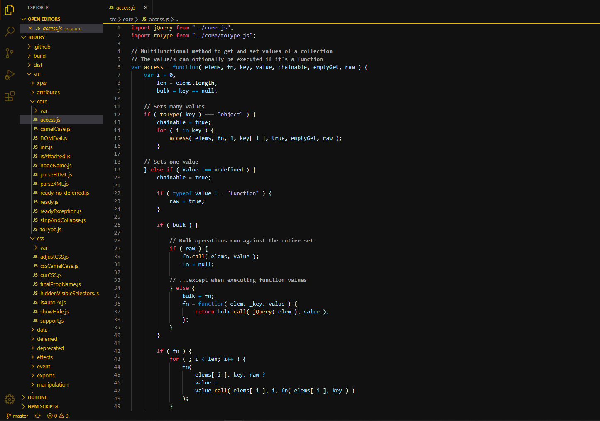

# Lively dark for Visual Studio Code

- A dark-goldish theme UI for [Visual Studio Code](https://code.visualstudio.com/)

## Installation

Launch VS Code Quick Open (⌘+P), paste the following command, and press enter.  
ext install lively-dark \
Or install this theme from the extension panel (search for "github theme"). \
You can find this theme in the Visual Studio Code Marketplace.

## License

MIT
