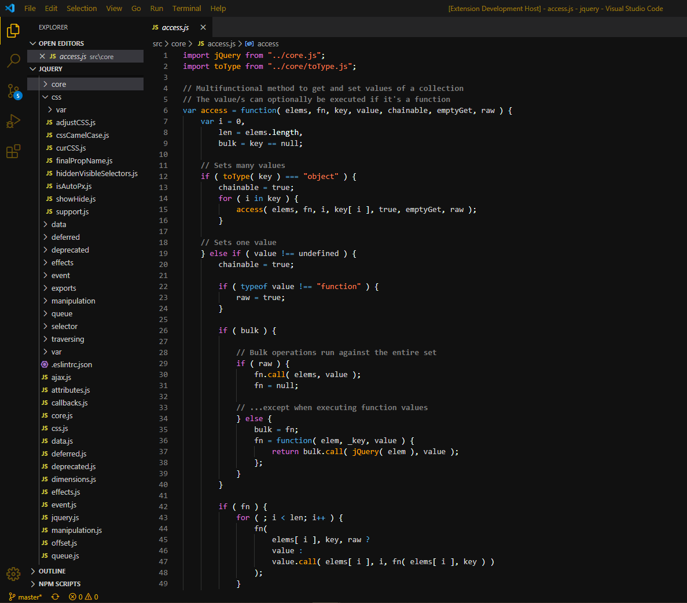

# Lively dark for Visual Studio Code

- A dark-goldish theme UI for [Visual Studio Code](https://code.visualstudio.com/)

## Installation
You can find this theme in the Visual Studio Code Marketplace.
Launch VS Code Quick Open (⌘+P) and paste the following command  
`ext install lively-dark` \
Or install this theme from the extension panel (search for "lively-dark"). \

## License

[MIT License](https://github.com/ferran1/vscode-lively-dark/blob/master/LICENSE)
